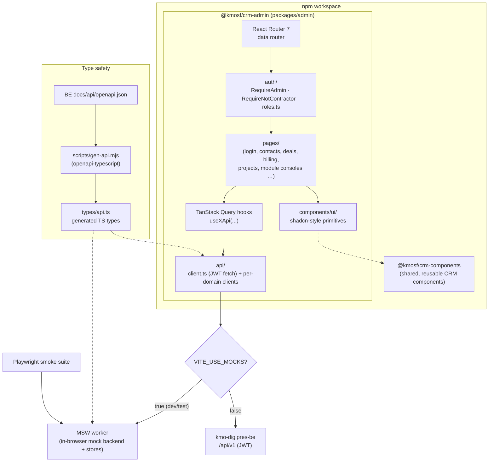

# kmo-digipres-fe

The **admin UI** for [`kmo-digipres-be`](../kmo-digipres-be/), the KMO Solutions
Foundry CRM backend. A single-page React app, Vite-built and Tailwind-styled,
used by external tenant administrators (non-technical business owners) as well
as KMOSF staff.

> **Naming note:** "digipres" / `com.kumouri` references are historical — this
> is the KMOSF CRM admin UI, not a separate product. See the backend
> [`CLAUDE.md`](../kmo-digipres-be/CLAUDE.md) for the full story.

It talks to the backend **exclusively** over its `/api/v1` REST surface, using a
JWT obtained from `POST /api/v1/auth/login`. In test/dev it can run fully
mocked via MSW, so no backend is required to develop or run the smoke suite.

---

## Stack

- **Vite 6** · **React 18** · **TypeScript 5** (full strict)
- **Tailwind 4** via `@tailwindcss/vite` — design tokens live under `@theme` in
  [`packages/admin/src/styles/globals.css`](packages/admin/src/styles/globals.css);
  no `tailwind.config.js`
- **shadcn-style primitives** (Radix + CVA + `cn()`) in
  [`packages/admin/src/app/components/ui/`](packages/admin/src/app/components/ui/)
- **React Router 7** (data router) · **TanStack Query 5** for server state
- **react-hook-form + zod** for forms · **sonner** toasts · **lucide-react** icons
- **Playwright** smoke tests (workspace root); **MSW** mocks the backend in test mode
- **npm workspaces** (Node 22+); single root `package-lock.json`

Path alias inside `@kmosf/crm-admin`: `@/` → `./src/app`.

---

## Architecture

The app is an npm workspace with the SPA package and a shared components package.
Every backend call goes through a single typed client; in mock mode an MSW worker
intercepts those calls so the same UI runs with or without a live backend.



### How it fits together

- **Typed API layer** — `api/client.ts` is the single fetch wrapper that attaches
  the JWT and the `/api/v1` base path. Per-domain modules (`api/contacts.ts`,
  `api/billing.ts`, the module consoles, …) build on it, and **TanStack Query
  hooks** (`useXApi`) are the only thing pages call for server state.
- **Generated types** — `scripts/gen-api.mjs` runs `openapi-typescript` against
  the backend's committed `docs/api/openapi.json` to produce `types/api.ts`.
  `npm run gen:api:check` fails CI if the checked-in types drift from the spec.
  Module endpoints that are `@ConditionalOnProperty`-gated in the backend are
  absent from the spec, so those clients are **hand-written** field-by-field
  against the Java records (and `gen:api:check` stays green).
- **Mock mode (MSW)** — when `VITE_USE_MOCKS=true` (always on under Playwright),
  an MSW worker boots with seeded in-memory stores that mirror the backend's
  status semantics and error codes. The smoke suite mirrors the backend's Java
  integration tests so behavior stays aligned across the two repos.
- **RBAC** — `app/auth/roles.ts` (`hasRole` / `isAdmin`) is the single source of
  truth, reused by the nav filter, the `RequireAdmin` / `RequireNotContractor`
  route guards, and per-view checks. The backend is the real authority; the UI
  guards mirror it for UX.
- **Theming** — class-based light/dark with a no-flash inline script; the token
  system in `globals.css` is a vendored copy of the canonical homepage tokens
  (re-synced manually on brand changes).

---

## Project layout

```
packages/
├── admin/                       # @kmosf/crm-admin — the SPA
│   └── src/
│       ├── main.tsx
│       ├── styles/globals.css   # Tailwind @theme tokens (vendored from homepage)
│       ├── mocks/               # MSW worker + seeded stores
│       └── app/
│           ├── App.tsx · router.tsx
│           ├── api/             # typed fetch client + per-domain clients
│           ├── auth/            # roles + route guards
│           ├── components/ui/   # shadcn-style primitives
│           └── pages/           # route screens + module consoles
└── crm-components/              # @kmosf/crm-components — shared CRM components
```

---

## Local development

All commands run from the **workspace root**; the root scripts proxy to
`@kmosf/crm-admin`.

```powershell
nvm use            # Node 22 (see .nvmrc)
npm install        # installs all workspaces
cp packages/admin/.env.example packages/admin/.env
npm run dev        # http://localhost:5173 (admin SPA, mocked by default)
```

Verify before pushing:

```powershell
npm run typecheck      # all workspaces
npm run build          # builds @kmosf/crm-admin
npm run verify         # typecheck + build
npm run gen:api:check  # fail if generated types drift from the BE OpenAPI spec
```

### Running against the real backend

```powershell
# In a sibling clone of kmo-digipres-be (with Mongo running):
./gradlew bootRun
# Then here:
$env:VITE_USE_MOCKS = "false"
npm run dev
```

See the backend [`README.md`](../kmo-digipres-be/README.md) for tenant
bootstrap; log in at `/login` with the admin credentials you created.

---

## Smoke tests

Playwright + MSW — no backend required (`VITE_USE_MOCKS=true`).

```powershell
npm run test:smoke:install   # one-time: install Chromium
npm run test:smoke           # headless
npm run test:smoke:ui        # interactive
npm run test:smoke:report    # last HTML report
```

---

## Environment variables

| Name                | Default                            | Used for                                |
| ------------------- | ---------------------------------- | --------------------------------------- |
| `VITE_API_BASE_URL` | `http://localhost:8080/api`        | Base URL for all backend calls          |
| `VITE_USE_MOCKS`    | `false` (`true` under Playwright)  | Bootstraps the MSW worker on startup    |

---

## License

This project is licensed under the **PolyForm Noncommercial License 1.0.0** —
free for personal and other noncommercial use, with **all commercial use
prohibited**. See [`LICENSE`](LICENSE).

Copyright © 2026 KMO Solutions Foundry LLC. All rights reserved except as
expressly granted by the license.

**Commercial licensing** — commercial rights are reserved by the copyright
holder. To license this software for commercial use, contact
[licensing@kmosolutionsfoundry.com](mailto:licensing@kmosolutionsfoundry.com).
